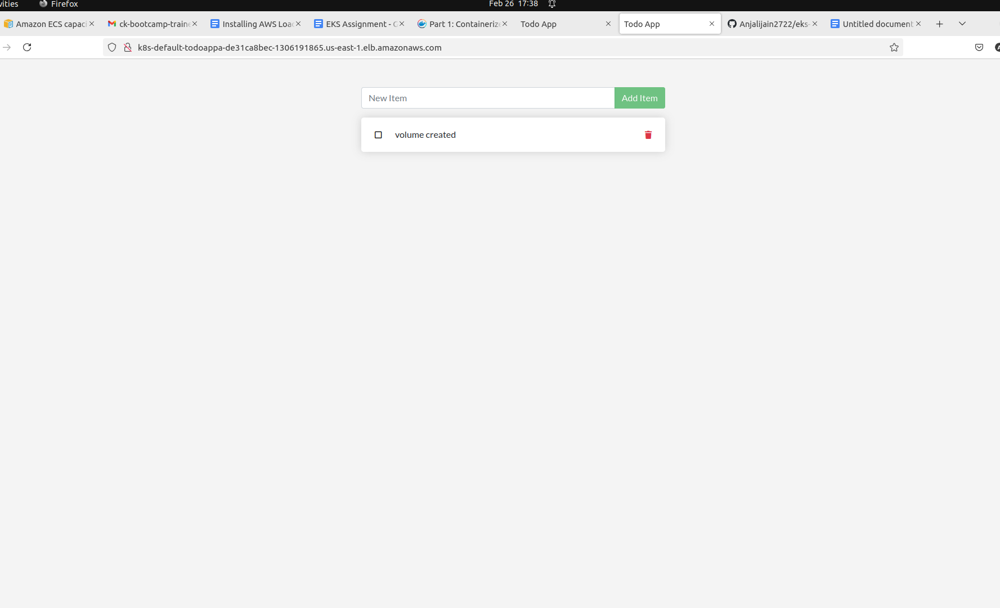

# Getting started

This repository is a sample application for users following the getting started guide at https://docs.docker.com/get-started/.

The application is based on the application from the getting started tutorial at https://github.com/docker/getting-started

